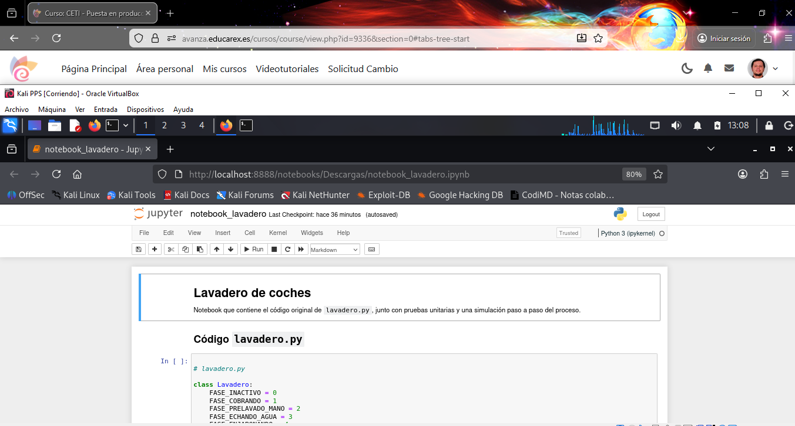

# 1. Documentación del programa

En este apartado se documenta el código fuente de la aplicación **Lavadero**, cuyo objetivo es simular el funcionamiento de un lavadero de coches automático con distintas opciones de lavado.

La documentación se ha realizado siguiendo buenas prácticas de programación, con comentarios claros y explicativos directamente en el código, así como documentación adicional mediante un cuaderno Jupyter.

---

## 1.1 Comentarios en el código fuente

Se han añadido comentarios detallados en el archivo `lavadero.py` para explicar:

- La finalidad de la clase `Lavadero`
- El significado de cada constante de fase
- El comportamiento de los métodos principales (`hacerLavado`, `_cobrar`, `avanzarFase`)
- Las reglas de negocio impuestas por el enunciado
- Las decisiones de flujo entre fases

Estos comentarios permiten comprender el funcionamiento interno del programa sin necesidad de ejecutar el código.

📸 **Código comentado en Visual Studio Code**  

---

## 1.2 Documentación mediante Jupyter Notebook

Como apoyo adicional, se ha creado un cuaderno Jupyter Notebook donde se explica:

- El enunciado del ejercicio
- El diseño general de la aplicación
- Ejemplos de uso del lavadero
- Fragmentos de código explicados paso a paso

Este formato facilita una comprensión más visual y didáctica del programa.

📓 **Notebook del proyecto:**  
👉 [notebook_lavadero.ipynb](../notebook_lavadero.ipynb)

📸 **Notebook visualizado en el navegador**  

---
