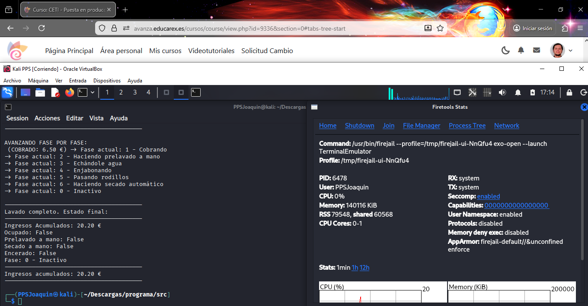

# 4. Ejecución de la aplicación en un entorno controlado (Sandbox)

Para mejorar la seguridad de la aplicación, se ha ejecutado en un entorno aislado utilizando **Firejail** junto con su interfaz gráfica **Firetools**.

---

## Herramientas utilizadas

- **Firejail**: sistema de sandboxing para Linux
- **Firetools**: interfaz gráfica para gestionar aplicaciones aisladas

Estas herramientas permiten limitar el acceso del programa al sistema operativo.

---

## Ejecución de la aplicación

La aplicación `main_app.py` se lanzó desde Firetools, ejecutándose dentro de un sandbox que restringe:
- Acceso al sistema de archivos
- Acceso a la red
- Acceso a otros procesos

**Aplicación ejecutándose en Firetools**  

---

## Ventajas del sandboxing

- Mayor seguridad ante fallos o comportamientos inesperados
- Protección del sistema anfitrión
- Buenas prácticas de puesta en producción segura

---
