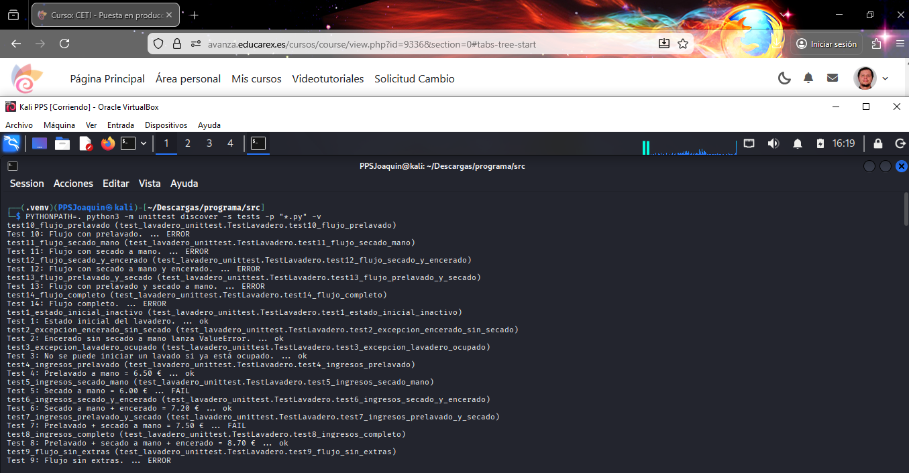
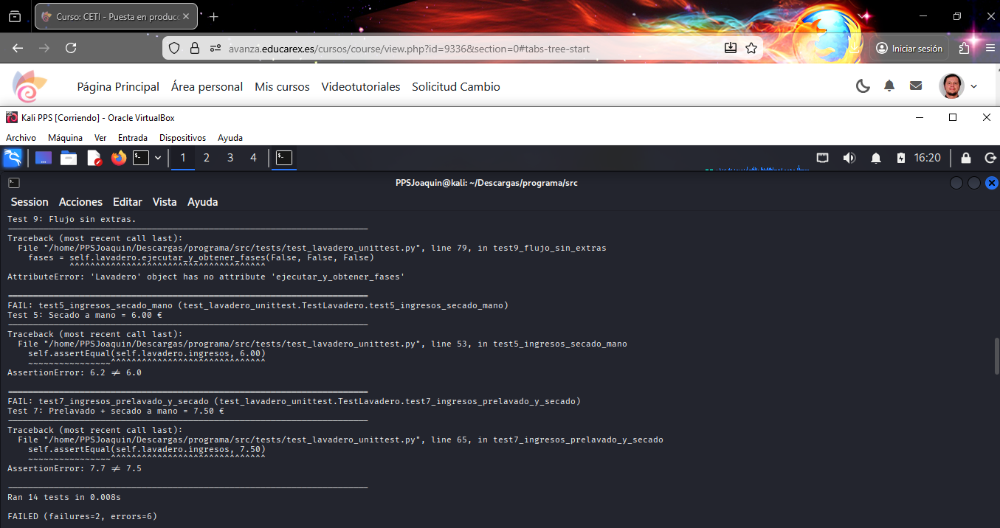

# 3. Pruebas unitarias y corrección del código de la aplicación

En este apartado se documenta de forma detallada el proceso completo de **ejecución de pruebas unitarias**, **detección de errores**, **análisis de fallos** y **corrección del código** de la aplicación del lavadero.

Este apartado es clave dentro de la asignatura *Puesta en Producción Segura*, ya que demuestra el uso de pruebas automáticas como mecanismo de control de calidad y detección temprana de errores antes del despliegue de una aplicación.

---

## 3.1 Entorno de pruebas

Las pruebas se han realizado en el siguiente entorno:

- Sistema operativo: **Kali Linux**
- Lenguaje: **Python 3**
- Framework de testing: **unittest**
- Entorno virtual: `.venv`
- Editor / IDE: **Visual Studio Code**
- Terminal: Bash

📄 Archivo de pruebas unitarias:  
[`tests/test_lavadero_unittest.py`](./tests/test_lavadero_unittest.py)

📄 Archivo de la aplicación corregido:  
[`lavadero.py`](./lavadero.py)

---

## 3.2 Ejecución de las pruebas unitarias

Las pruebas se ejecutaron desde terminal utilizando el descubrimiento automático de tests:

```bash
PYTHONPATH=. python3 -m unittest discover -s tests -p "*.py" -v
```
El parámetro -v (verbose) permite visualizar el resultado detallado de cada prueba, facilitando el análisis de errores.

---

## 3.3 Tipos de pruebas realizadas

### Test 1 – Estado inicial
Comprueba que al crear un lavadero:
- Fase = 0 (Inactivo)
- No está ocupado
- Ingresos = 0 €
- Todas las opciones a `False`

---

### Tests 2 y 3 – Reglas de negocio
Verifican que:
- No se puede encerar sin secado a mano (`ValueError`)
- No se puede iniciar un lavado si el lavadero está ocupado (`RuntimeError`)

---

### Tests 4 a 8 – Cálculo de ingresos
Comprueban que los ingresos coinciden exactamente con los valores del enunciado:

| Opción | Ingresos |
|------|---------|
| Prelavado | 6,50 € |
| Secado a mano | 6,00 € |
| Secado + encerado | 7,20 € |
| Prelavado + secado | 7,50 € |
| Lavado completo | 8,70 € |

---

### Tests 9 a 14 – Flujo de fases
Comprueban que el lavadero pasa por las fases correctas según las opciones seleccionadas.

Ejemplo:
```python
[0, 1, 3, 4, 5, 6, 0]
```

## 3.4 Resultados iniciales: detección de errores

En la primera ejecución de las pruebas sobre el código original de lavadero.py, se detectaron múltiples errores y fallos.

**Capturas de la ejecución con errores**




Salida completa de la ejecución con errores:
salidatesterror.txt

Resumen de resultados iniciales

14 tests ejecutados

2 fallos (FAIL)

6 errores (ERROR)

6 tests correctos (OK)

Esto indicaba claramente que la aplicación no cumplía aún los requisitos funcionales definidos por los tests.

3.4 Análisis detallado de los fallos (FAIL)
3.4.1 Error en el cálculo del precio del secado a mano

Test afectado:
test5_ingresos_secado_mano

Mensaje de error:

AssertionError: 6.2 != 6.0


📄 Localización del test:
test_lavadero_unittest.py

Descripción:
El test esperaba que un lavado con solo secado a mano tuviera un coste total de 6,00 €, pero el código original devolvía 6,20 €.

Causa del error:
En el método _cobrar() del archivo lavadero.py, el incremento aplicado al secado a mano era incorrecto.

Corrección aplicada:

if self.__secado_a_mano:
    coste_lavado += 1.00

3.4.2 Error en el cálculo de prelavado + secado a mano

Test afectado:
test7_ingresos_prelavado_y_secado

Mensaje de error:

AssertionError: 7.7 != 7.5


Descripción:
El precio calculado no coincidía con el valor esperado por el test.

Causa del error:
Los incrementos de precio definidos en _cobrar() no estaban alineados con los valores exigidos por los tests unitarios.

Solución aplicada:
Se ajustaron los precios definitivos a:

Opción	Incremento
Prelavado a mano	+1,50 €
Secado a mano	+1,00 €
Encerado	+1,20 €
3.5 Análisis de los errores de ejecución (ERROR)
3.5.1 Método inexistente ejecutar_y_obtener_fases

Tests afectados:
test9 a test14

Mensaje de error:

AttributeError: 'Lavadero' object has no attribute 'ejecutar_y_obtener_fases'


Causa:
El método ejecutar_y_obtener_fases:

No estaba definido dentro de la clase Lavadero

Llamaba a un método inexistente _hacer_lavado

Solución aplicada:

Se movió el método dentro de la clase Lavadero

Se corrigió la llamada a hacerLavado()

📄 Código corregido:
lavadero.py

3.5.2 Error lógico en el flujo de fases (avanzarFase)

Este error no generaba errores de sintaxis, pero provocaba que los tests de flujo fallaran.

Problemas detectados:

El flujo desde la fase de rodillos era incorrecto

El secado a mano no se ejecutaba correctamente

El encerado no se alcanzaba aunque estuviera seleccionado

El lavado terminaba antes de tiempo

Correcciones aplicadas:

Desde FASE_RODILLOS:

Si secado_a_mano → FASE_SECADO_MANO

Si no → FASE_SECADO_AUTOMATICO

Desde FASE_SECADO_MANO:

Si encerado → FASE_ENCERADO

Si no → finalizar lavado

Esto permitió que el flujo coincidiera exactamente con los valores esperados por los tests.

3.6 Resultados finales tras las correcciones

Tras aplicar todas las correcciones, se volvió a ejecutar la batería completa de tests.

📸 Captura de tests superados correctamente


📄 Salida completa de la ejecución corregida:
salidatestcorregida.txt

Resultado final:
